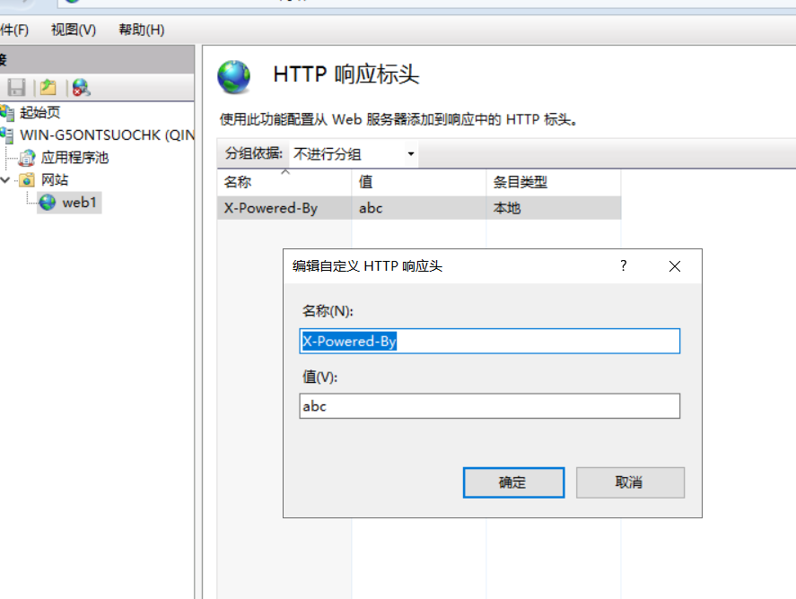

# 设置IIS10的HTTP响应头去除版本信息

## X-Powered-By头设置

找到HTTP响应标头并进入。


然后编辑成自己想要的，也可以直接删除了。




## Server头设置

找到配置编辑器并进入。


依次根据上图找到requestFiltering这个配置。

然后把removeServerHeader改成True，应用，server头就没了。


##  X-AspNet-Version头设置

到system.web下找到httpRuntime。


把enableVersionHeader改为False。应用就好了。


## 最后

以上修改对应的修改配置文件就是网站目录下的web.config文件，可以直接修改web.config文件达到以上效果，可惜我喜欢使用图形化界面修改，怕改错了，不懂不懂。

```
<?xml version="1.0" encoding="UTF-8"?>
<configuration>
    <system.webServer>
        <httpProtocol>
            <customHeaders>
                <remove name="X-Powered-By" />
            </customHeaders>
        </httpProtocol>
        <staticContent>
            <clientCache cacheControlMode="NoControl" />
        </staticContent>
        <security>
            <requestFiltering removeServerHeader="true" />
        </security>
    </system.webServer>
    <system.web>
        <httpRuntime enableVersionHeader="false" />
    </system.web>
</configuration>
```

