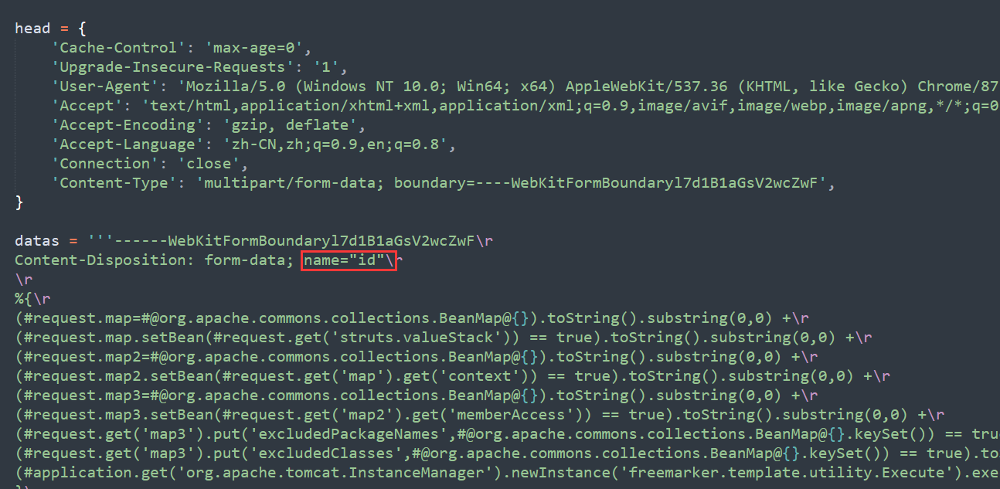

# ~~前言~~（废话）

一直以来的还是挺菜的吧，从今年开始参加hvv以后成长了不少。

思考了很多，也有了一些总结。

# 关于工具

## 从自己最初理解的开始搞缝合怪。

当我参加hvv时，因为第一次参加我准备了xray还有各种nday的poc，以及弱口令监测工具。

为了快速使用nday打点。我准备的是vulmap和POC-bomber。然后指纹识别使用Ehole。

当时我就想鸭，三个工具肯定是指纹识别，然后再用vulmap和POC-bomber跑一边的同时，通过Ehole指纹识别的结果做专项漏洞测试，比如什么如果使用了shiro框架就有什么shiro反序列化利用工具来跑跑看看。

然后hvv以单位为目标别说有好几个单位，就是一个单位也有好些资产好些url，这种时候每一个都打开一次vulmap和POC-bomber跑麻烦。恰好这两个工具都可以直接从文档读取文件可以把信息收集到的目标url放到txt文档中然后跑。再然后吧？这个文档应该放哪里呢？vulmap的目录下？还是放POC-bomber目录下方便？算了吧桌面？

再再然后吧不如搞个目录放着吧，然后同时存放vulmap和POC-bomber的扫描的生成结果，考虑到信息收集还没有fofa这些高级会员而且就算有会员也需要把搜到的东西一个一个验证是否是目标资产再放入vulmap和POC-bomber的txt中。这样想不如写个脚本算啦。然后就写了一个脚本可以添加目标url写入到txt中，通过Ehole来做指纹识别，识别到指纹脚本继续向下执行vulmap和poc-bomber扫着的同时自己根据Ehole的指纹识别结果用对应的工具来测一遍。想想挺不错确实也还行，但是把突然那如果测过的目标，下次不小心有添加进去了添加到txt里面两次或者多次怎么办vulmap和poc-bomer可还会扫多余，于是加了一个去重，在考虑吧如果输入回车或者abc这些不小心按错了的非url怎么办。于是。。咳咳扯远了。继续之前的话题。

没错这就是一个缝合怪，那段时间恰好看到网上好多这种类似的工具就是集成了好几个工具的这种一键开干的工具，感觉他们的想法和我不谋而合。

## Goby神器鸭

想法是挺好的有了这个脚本以后加上xray啥的其他工具感觉打点应该没啥问题了。

但是实际上场的时候才突然发现，比如tomcat或者weblogic这些端口基本不会再80端口回测漏洞。或者有些其他端口会有其他很容易被打进去的web站点。怎么办这个脚本的问题突然显现出来了，就是少了一个端口扫描啥的然后添加。

然后在考虑，因为输入不存在的url会跳转到首页导致部分扫描的poc误报怎么办？比如一个php的站点竟然会被poc-bomer检测到s2的漏洞。怎么可能呢？肯定是误报，这需要指纹识别鸭。

再有这个脚本还不能做弱口令检测，比如我ssh改成了2222端口怎么自动扫了以后指纹识别然后做弱口令检测呢？而不是手动一个一个测，比如扫了一堆的ip有一堆的ssh协议ftp的mysql的什么tomcat的都要自己慢慢捋清楚然后拿去做弱口令检测？

有没有这样一个自动化的工具可以做这些呢？

于是回过头来看以前不觉得咋样的goby。突然就觉得很香，不仅可以做端口扫描指纹识别还有poc可以检测，还可以检测对应协议的弱口令。只是我手里就是普通版本不是红队版poc少。

突然明白goby真的不愧为神器。除了goby你还可以按照这种思路开发一款属于你自己的自动化工具？反正我是开发不出来。

## xray不能少鸭

那goby有缺点嘛？有的他不能检测sql注入、xss、命令注入这些常规漏洞。

还有一个问题有些漏洞是根据参数来检测漏洞的比如s2-062这个漏洞网上大多的poc的参数都是id。那么显示系统中的漏洞参数都是id嘛？这种类似于sql注入一样需要根据参数来扫描的，感觉goby做不了。

因此就想到了另一款神器xray。这东西好东西鸭不仅可以被动测试参数，也有poc不过社区版的真的少。

但是总比手工测好很多了，怎么说呢？且不说你手动能不能一个参数一个参数测完，就说你测的有工具好嘛？比如测试sql注入，你手工测加个单引号，and 1=1什么的可能测不出来，人家xray不一样人家内置的payload比普通的好，你测不出来的人家可能测出来了，有waf的还能过部分waf。

虽然我不知道xray能不能根据参数来扫s2-062这种，但是感觉这是一个思路，需要一个xray一样的工具来被动检测参数，应该提供那么一个接口可以写poc的时候吧poc指定为根据参数来检测和检测sql注入一样，被动扫描的时候扫，而不是说单纯的就是poc死死的就id参数。

反正我这种菜鸡是做不到了。虽然思考能思考到这些但是个人能力在这摆着，没法开发出这种东西出来。

**现阶段要做的就是脚本小子我最棒。用好各种工具搞好渗透。！**

# 关于挖洞

举一反三。

