# weblogic环境搭建

下载一个jar的安装包以后，使用java -jar .\fmw_14.1.1.0.0_wls_lite_generic.jar打开。

然后下一步下一步，安装类型选第一个weblogic server，然后再下一步下一步。安装。

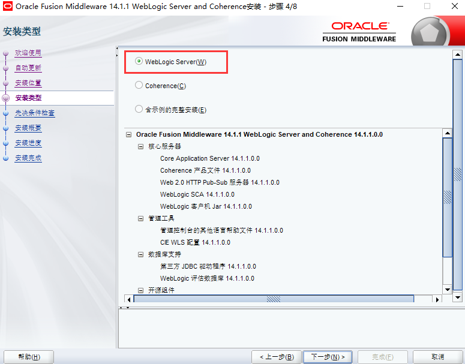

完成那里勾上自动启动配置向导，默认是勾上的，直接点完成即可。

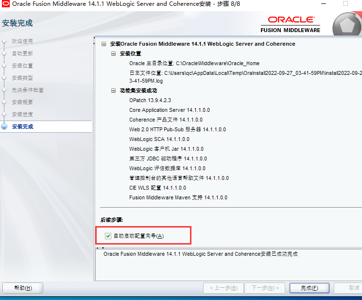

选创建新域。

使用的模板创建域全都勾上。

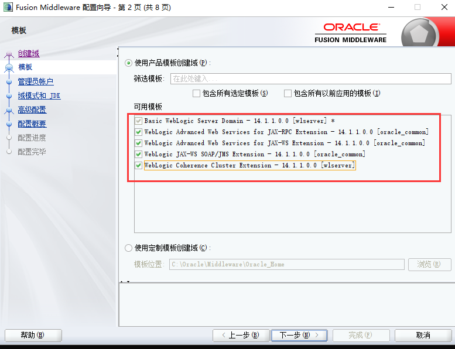

设置登录口令，有个密码复杂度的要求。

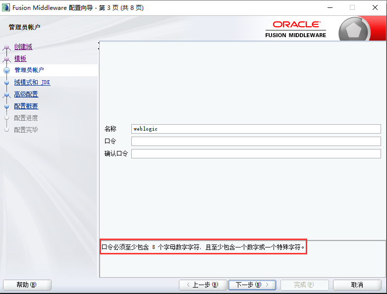

下面这里都勾上。

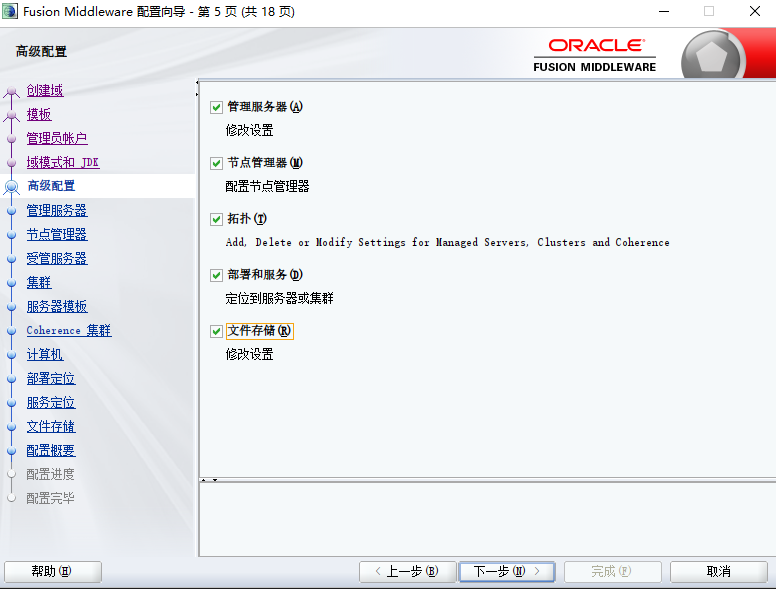

然后设置一下账号密码。

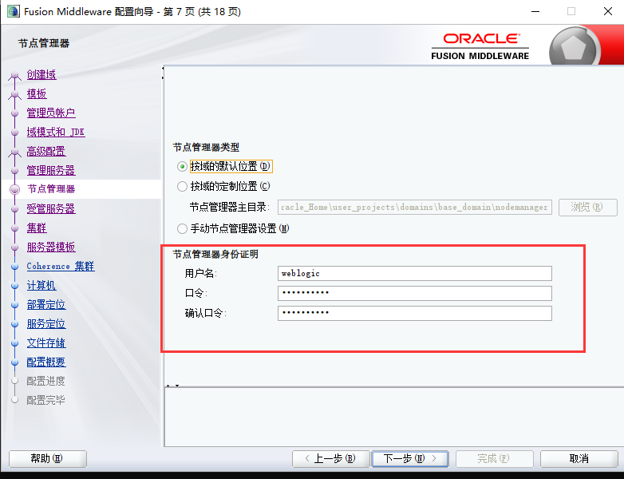

直接下一步下一步然后点创建。

最后勾选启动管理服务器点完成。

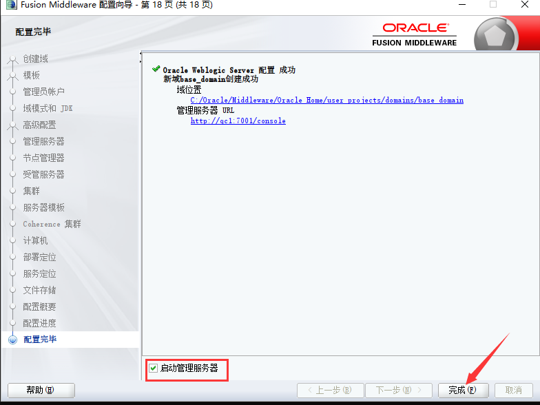

相当于运行这个startWeblogic.cmd这个文件。

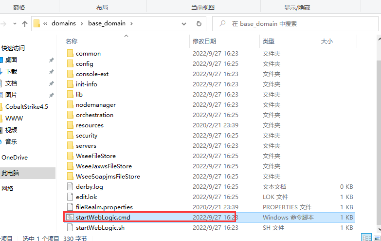

登录后台看看。

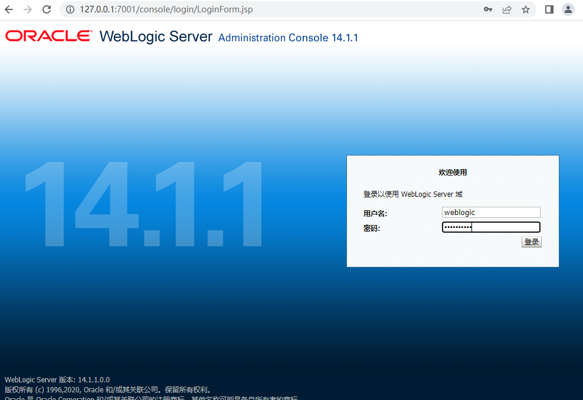

部署应用的话就点部署，点安装。

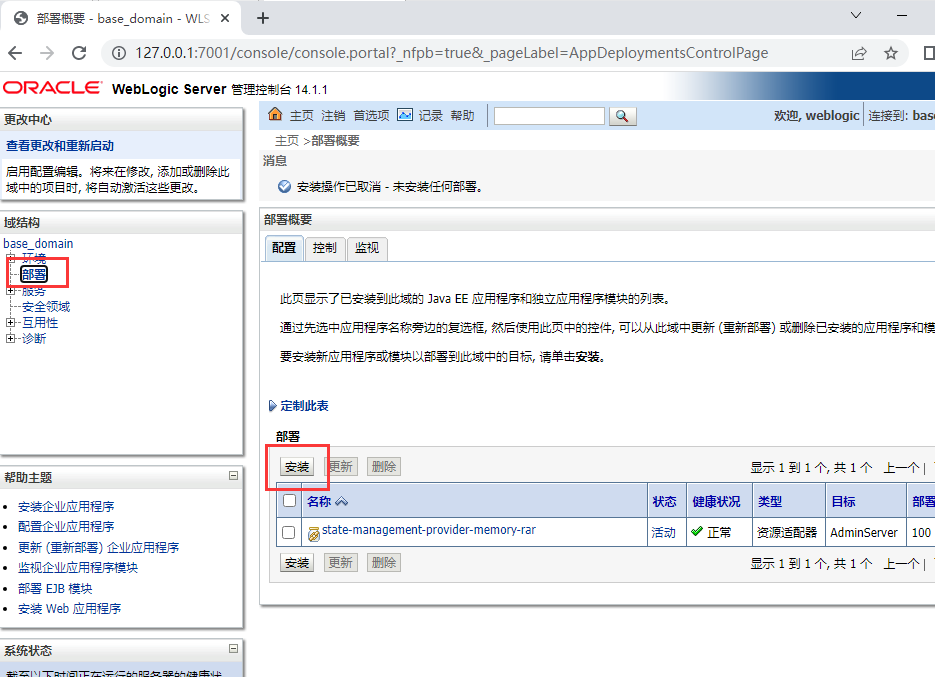

可以本地装，如果是远程浏览器访问部署的，就需要选上传文件。

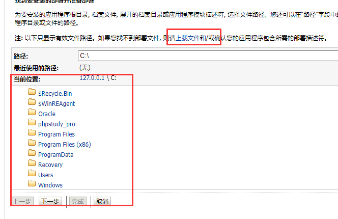

我就选远程的上传。

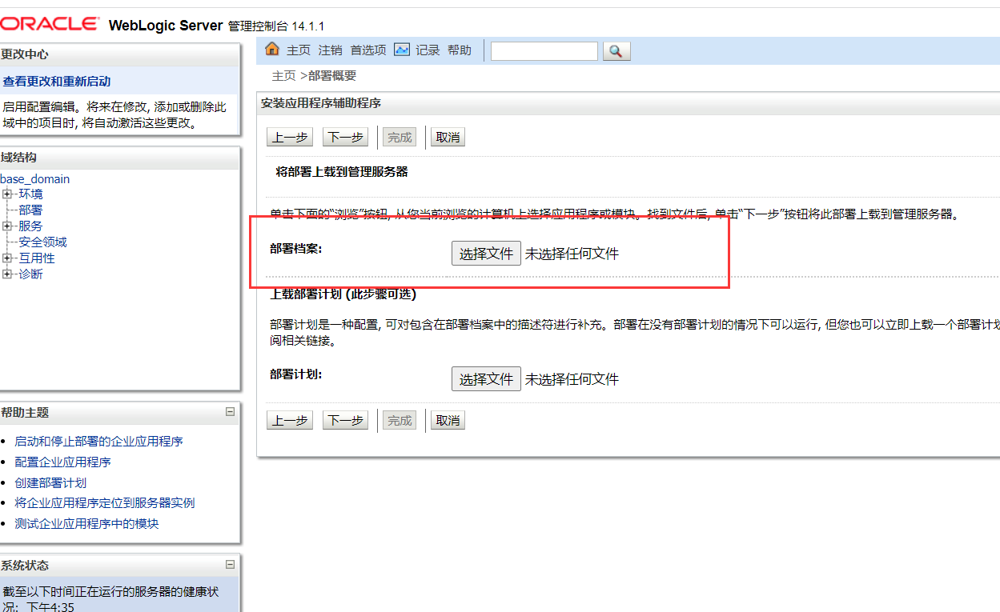

下一步

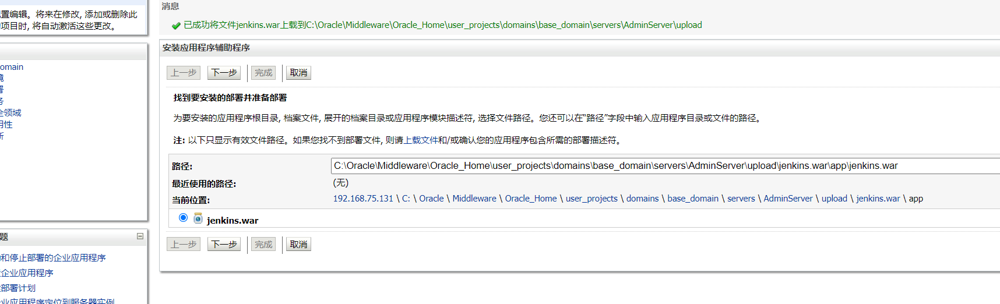

下面这里要选将此部署安装为应用程序。

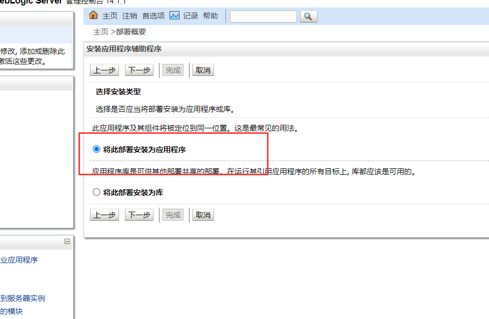

然后下一步下一步，完成。

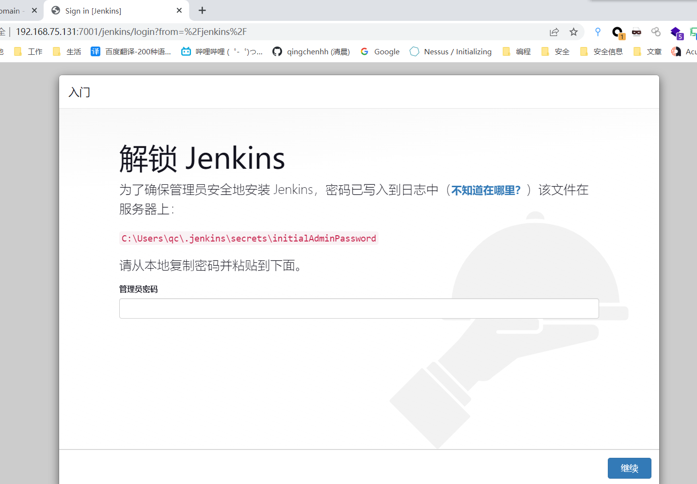