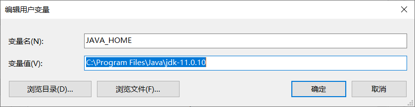
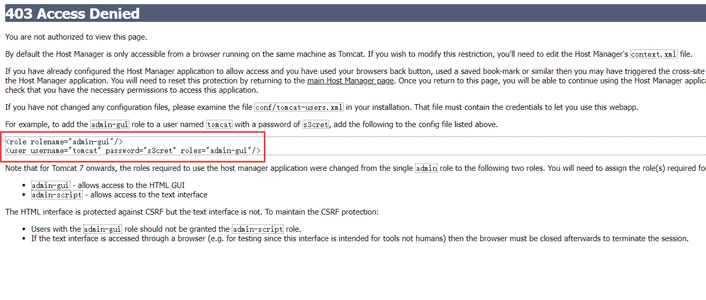
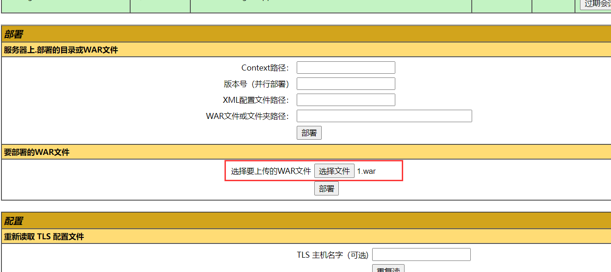
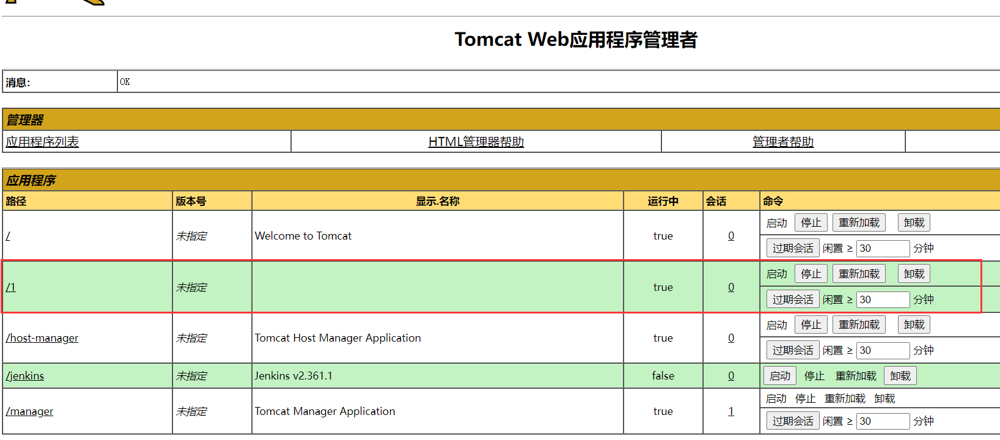
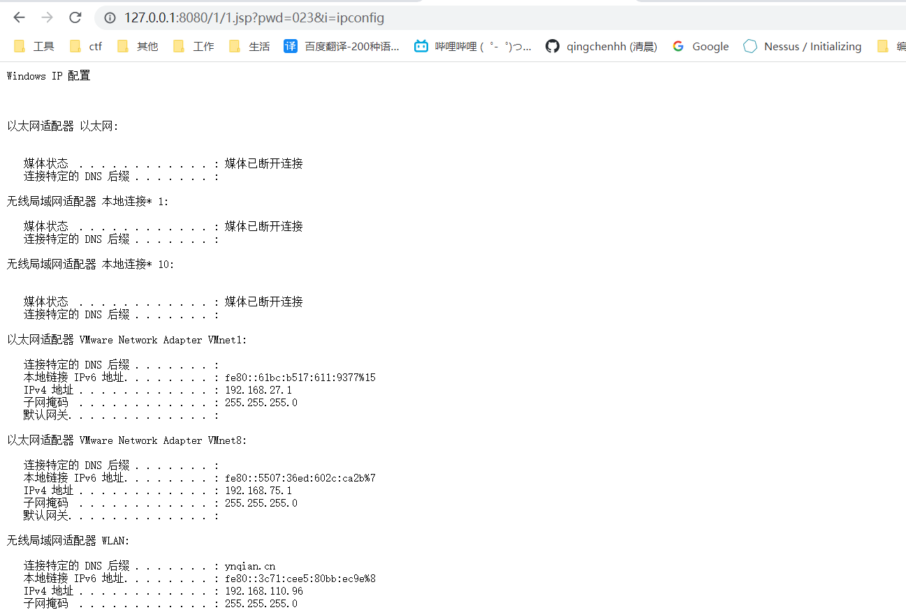

# Tomcat环境搭建

>Tomcat版本：10.0.23 免安装zip包。
>
>搭建平台：Windows 10

解压以后到bin目录下运行startup.bat启动Tomcat，但是需要注意的时，启动如果没有设置JAVA_HOME 或JRE_HOME其中一个环境变量，需要去增加一个，然后把Java的路径填上。



不然运行会有一下报错提示，当然了直接双击startup.bat文件是一闪而过看不到提示的，放到cmd下运行就可以看到了。

> Neither the JAVA_HOME nor the JRE_HOME environment variable is defined
> At least one of these environment variable is needed to run this program

然后到conf目录下面配置一下tomcat-users.xml文件，不然浏览器端不方便做管理，默认是没有配置任何用户的，当然你不想使用浏览器端管理不配置也可以的。



就照着格式来，配置一个自定义的用户名和密码，然后给一下权限，可以访问哪些页面。

```
<role rolename="manager-gui"/>
  <role rolename="manager-script"/>
  <role rolename="manager-jmx"/>
  <role rolename="manager-status"/>
  <role rolename="admin-gui"/>
  <role rolename="admin-script"/>
  <user username="qc" password="Qingchen" roles="manager-gui,manager-script,manager-jmx,manager-status,admin-gui,admin-script"/>
```

Tomcat默认只允许本地的127.0.0.1来访问，如果需要让外面的IP访问，需要注释掉webapps\manager\META-INF\context.xml文件里的那段限制代码，我嘛本地搭建不需要外部访问，为了安全就不对外开放了。

```
<Context antiResourceLocking="false" privileged="true" >
  <CookieProcessor className="org.apache.tomcat.util.http.Rfc6265CookieProcessor"
                   sameSiteCookies="strict" />
  <Valve className="org.apache.catalina.valves.RemoteAddrValve"
         allow="127\.\d+\.\d+\.\d+|::1|0:0:0:0:0:0:0:1" />
  <Manager sessionAttributeValueClassNameFilter="java\.lang\.(?:Boolean|Integer|Long|Number|String)|org\.apache\.catalina\.filters\.CsrfPreventionFilter\$LruCache(?:\$1)?|java\.util\.(?:Linked)?HashMap"/>
</Context>
```

然后部署一个一句话上去吧。

先把一句话的jsp马使用压缩工具压缩成zip的格式，然后再把后缀改成war，就可以拿来部署了。



访问执行一下看看一句话是否正常。

