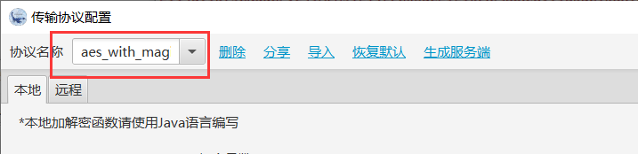

# webshell流量特征研究

## 蚁剑

>版本：蚁剑  v2.1.15
>
>webshell类型：php

编码解码器设置为default，就是不对流量进行任何加密编码。

然后抓包，请求包和响应包均明文传输。

请求包特征明显，直接是php代码。响应包中的前后都有随机字符串包裹，但是字符串个数随机，不固定。

把编码解码改成base64再进行连接抓包。

可以看到请求和响应数据包中的payload已经经过base64编码。

请求包中带有%40eval(%40base64_decode(%24_POST%5B'__14位随机字符__'%5D))%3B的流量特征,响应包前后均有随机字符，中间为base64数据。

使用RSA加密试试，结果发现请求内容虽然被加密了，但是响应内容却无法做到使用RSA加密，依然有选择其他解码器的特征。

总结：可以说蚁剑的流量特征还是挺明显的默认的自带的这些，虽然最新版本已经把user-agent的特征改成正常浏览器的特征了，但是流量里的特征依然明显。

## 冰蝎

>版本：behinder_v4.0.5
>
>webshell类型：php

使用aes_with_magic生产的脚本。

数据包如下：

可以说单从数据包来讲没有什么明显的特征。

## 哥斯拉

>版本：v4.0.1-godzilla
>
>webshell类型：php

加密器：PHP_EVAL_XOR_BASE64

通过解码可以看到payload内容。

特征的话我觉得__eval%28base64_decode%28strrev%28urldecode%28%27__就可以算是特征了。

加密器：PHP_XOR_BASE64

抓到的数据包都是加密的内容，但是发现响应包的前后都是16位的随机字符串，中间是base64编码的内容，解码后为乱码。

加密器：PHP_XOR_RAW

发现数据包中都是一堆乱七八糟的东西，看不懂，但是仔细对比发现，所有响应包开头都包含了__相同10位__的随机字符串，而前9位可能会在请求包的包头出现，而且请求头的Content-Type: application/octet-stream。

------

暂时就这些了。

个人水平有限，就先暂时研究一下PHP的，其他类型的不知道是否有这些流量特征。
