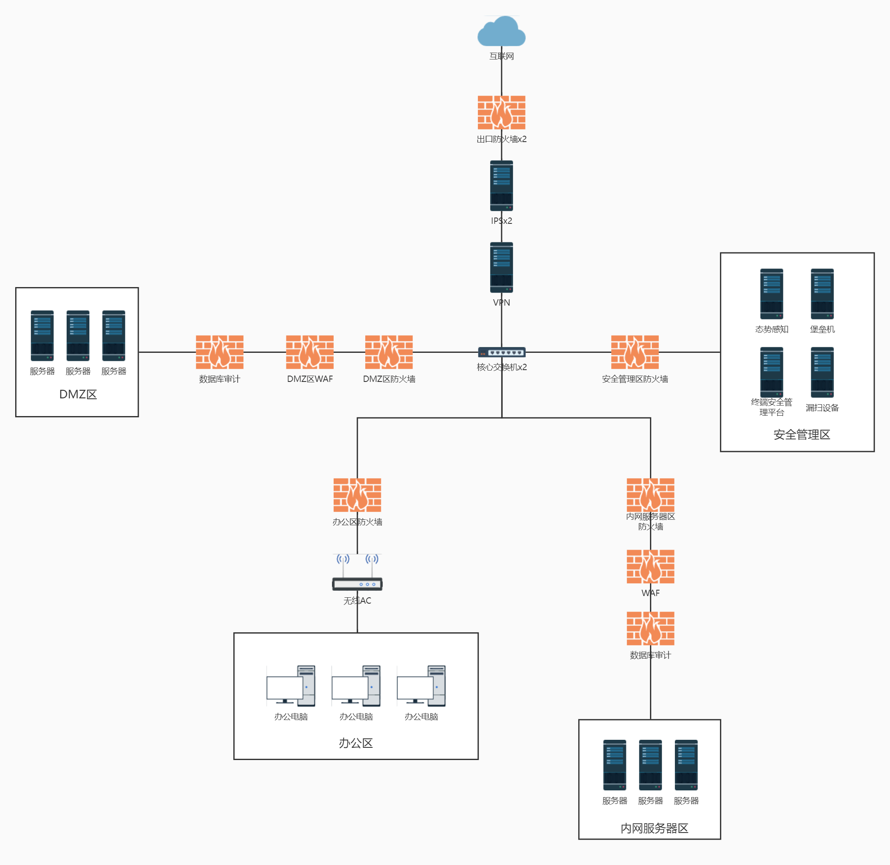

# 企业安全建设——By 清晨

## 前言

今年打过省hvv的红队，也当过国hvv的蓝队，20大重保，就在想企业怎么做才能防的住。

无非就是。

1）事前的加固+防御加网络上的信息泄露排查

2）事中的对攻击IP的封锁。

3）事后的应急响应，把损失降到最小以及最快恢复业务。

那么又需要哪些安全设备？平时需要怎么用这些安全设备？平时的安全运营需要怎么做？。

就开始尝试写一下。。。

# 1. 企业网络架构规划

## 1.1 拓扑规划、区域规划

简单的网络拓扑图：

1. 首先就是要规划清楚，办公区什么网段，服务器区什么网段，DMZ区什么网段，出现安全问题的时候通过IP段可以很好的确定是哪个地方出现了问题。
2. 对于需要提供对互联网访问的系统，不是很重要的，如官网、微信公众号小程序的服务器。
3. 对于比较重要的系统，需要放到内网服务器区，如：企业OA、企业邮箱、财务管理系统等；内网服务器区互联网无法访问，且DMZ区和内网服务器区网络不可达。
4. 严格限定互联网出口只能是一个，不能设计多个互联网出口，不好防护。
5. 为了保证主干链路能够撑得住，应该每个设备都两台，所以出口防火墙两台、IPS两台、核心交换机两台。

## 1.2 整体安全建设分析

1. 要隔离各个区域做到安全最大化，就需要防火墙，这防火墙可以不买ips或者应用层防护等功能的授权，只需要简单访问控制授权做访问控制策略和DDOS防护等基础网络安全防护功能；同时为了防止其他电脑中毒或者防御黑客的横向渗透，都需要防火墙对高危端口进行封堵（135、139、445、449等）。
2. 当然了为了让出差或者其他需要远程办公的员工可以正常办公，就少不了VPN，这个没啥说的，但是因为链接VPN就等于直接接入了企业的内网，因此为了考虑安全性，建议使用双因子验证。
3. IPS是防火墙和防病毒的一种补充，因为服务器有WAF，但是办公区域啥都没有，而且不在出口放一个IPS进行防御怎么不太好。
4. 因为防火墙没有考虑应用层的防护所以就需要在服务器前面加WAF，这样不管是来之内网的攻击还是来之互联网的攻击WAF都可以拦截得到。
5. 同时数据库的漏洞不方便修复，对于数据库来说升级版本啥的有可能是致命的，所以就加了一个数据库审计设备，既可以使用虚拟补丁做一下防护，有可以对数据库操作进行防护和审计。
6. 再考虑办公区域笔记本电脑员工的手机需要使用无线网，因此为了统一管理，使用了无线AC来管理，最好带有上网行为管理。
7. 再考虑服务器的平时运维管理，结合安全考虑需要加堡垒机，所有服务器的管理只能通过堡垒机进行，防火墙严格阻断了所有策略，没法直接3389或者ssh远程管理，需要通过堡垒机跳过去才行；这样做不仅严格限制了服务器收到攻击后的横向，也限制了运维人员登录其他运维人员的服务器的情况，比如得到了其他服务器的账号密码也不能登录，需要登录堡垒机才能操作；同时堡垒机还会对你的管理操作进行审计记录；缺点就是堡垒机如果沦陷了，那基本就完了，因为好些堡垒机可以直接填写密码再上面，记住密码然后直接点链接来管理的，所以为了保证安全性建议堡垒机开启双因子认证。
8. 那么接下来是防病毒方面，为了保证终端安全，应该再服务器上都装上防病毒产品，办公电脑尽量装，同时也可以通过防病毒终端来对非法外联和移动介质的管理，还可以统一打补丁之类的，方便统一集中对终端的管控。
9. 防护当然少不了自查，这就需要漏扫工具，需要定时每个月或者多长时间对整个内网进行一次漏扫，及时发现漏洞或者风险进行修复。
10. 为了统一的检测整个内网的安全情况，就需要一个态势感知。
11. 以上都是被动防护的，如果需要主动防护，可以搭建一个蜜罐来捕捉黑客攻击。
12. 当然了以上都是事前的防御，那么事后呢？如果可以可以加一个日志服务器或者日志审计服务器，既可以统一集中收集管理日志，又可以在黑客入侵做痕迹清理依然有一份日志可以看。
13. 所有防护产品都有误报，为了保证把业务影响讲到最低，需要安全人员话一个月左右的事件进行大量告警查看分析，把误报的添加白名单，优化安全防护策略。

**不是说买了安全设备就安全了，关键在于怎么用！！！比如防火墙不是策略全通，那买了干啥？应该仔细核对业务系统开放对应端口，其余的全部拒绝，其他安全产品同理，把安全防护最大化，对业务系统的影响最小化。**

# 2. 企业安全设备规划

## 2.1 出口防火墙

1. 采购产品时需要考虑吞吐量是否满足需求。
2. 对于出口防火墙而言，因为需要支撑吞吐量，所以建议不开启应用层的防护，只使用访问控制策略。
3. 只有对互联网开放的系统才映射到互联网，杜绝映射多余系统到互联网。
4. 开启防DDOS功能。

## 2.2 IPS

1. 开启全面的防护功能、防病毒功能，防护需要考虑承载能力，网络负荷等。
2. 做策略优化，用一两个月的时间尽可能收集误报，然后添加白名单。

## 2.3 VPN

1. 采购需要考虑安全性，以及功能的细粒度，比如权限是否能够严格控制。
2. 严格根据人员分配VPN账号，根据人员严格限制VPN权限。
3. 开启密码复杂度策略强制要求使用强密码，开启防止爆破策略。
4. 建议开启双因子认证。

##  2.4 DMZ区防火墙、服务器区防火墙、安全管理区防火墙

1. 只对堡垒机IP放通管理端口，如3389、22等。
2. 根据资产仔细核对每一个业务需要对外开放什么端口，然后开放对应的端口，**做到策略最细化**，不对外开放多余端口，如数据库端口、其他外部不需要访问的接口的端口等。
3. 漏扫设备添加白名单，全放通。
4. 除了个别规划好的系统外不允许任何服务器能够出网，这里的出网是既不能访问内网其他区域也不能访问互联网。
5. 可以开启安全防护功能。（如：放爆破、防扫描、发现异常主机限制异常主机访问互联网等）
6. 封堵高危端口（135、139、445、449等）。
7. 开启默认拒绝所有的策略。

## 2.5 DMZ区WAF、服务器区WAF

1. WAF的购买需要考虑吞吐量，不够可以用两台。
2. 看需求开启防护功能，尽量把防护开打最大化（如防止爆破、防扫描、拦截攻击）。
3. 做策略优化，用一两个月的时间尽可能收集误报，然后添加白名单。
4. 最好带有网页防篡改功能，重保期间防止网页被篡改就很有用（主要针对DMZ区）。
5. 对漏扫设备添加白名单。

## 2.6 DMZ区数据库审计、服务器区数据库审计

1. 这个没啥好说的，把防护和审计开着就行了。

## 2.7 办公区防火墙

1. 其他区域不能主动访问办公区域，除了办公区域访问其他区域的响应数据包外。
2. 封堵高危端口（135、139、445、449等）。
3. 对漏扫设备添加白名单，全放通。

## 2.8 无线AC

1. 开启认证，使用WiFi时需要通过员工账号密码登录。
2. 建议购买带有上网行为管理功能的设备，开启上网行为管理功能。

## 2.9 态势感知

1. 镜像核心交换机所有流量、办公区域的所有流量，要做到流量全镜像。
2. 做策略优化，用一两个月的时间尽可能收集误报，然后添加白名单。
3. 尽可能添加各安全设备的日志，更全的收集整个内网的攻击情况。
4. 最好是可以和防火墙联动，可以直接联动封锁恶意IP，方便。

## 2.10 堡垒机

1. 购买时应该考虑权限分配细粒度和操作行为审计全面性和细粒度。
2. 严格按照运维人员需求建立运维账号分配对应管理的服务器权限。
3. 所有服务器的运维管理、服务器上数据库中间件的管理全部只能通过堡垒机来进行。
4. 开启密码复杂度策略强制要求使用强密码，开启防止爆破策略。
5. 建议开启双因子认证。

## 2.11 终端安全

1. 购买时应考虑杀毒防护效果较好的产品，还带有防暴力破解等实用功能的最佳。
2. 建议所有服务器安装终端安全产品，办公系统尽量都装。
3. 即使更新病毒库和特征库。
4. 根据需求开启非法外联和存储介质管理。

## 2.12 漏扫设备

1. 尽量购买扫描漏洞比较全面的产品，比如带有弱口令检测的，基线检查的，web漏洞的，系统漏扫的这些。
2. 建立计划任务，至少每月定时扫描一次所有服务器和办公电脑、安全设备、打印机等所有设备。
3. 及时更新漏扫设备的漏洞库。

## 2.13 日志审计

1. 尽可能的收集个服务器的日志，以便监控服务器的安全运行情况，且还可以放置被黑客入侵后做痕迹清理把日志删了。

## 2.14 蜜罐

1. 有钱的话可以部署一套蜜罐，做的尽量逼真，映射到外网，检测攻击情况。

# 3. 企业运营建设

## 3.1 人员配置

1. 至少需要一个专门管安全的人员，平时负责处理安全事件，负责安全设备的更新。
2. 最好配置一个网络管理员，系统管理员。

## 3.2 资产梳理

1. 整理保存详细的网络拓扑图，而且网络拓扑改动时及时更新。
2. 详细整理企业资产，如：业务系统、负责人、运维人员、机房、机柜、操作系统、IP地址、开放端口及服务、业务系统使用的框架及版本、中间件及版本、数据库及版本等详细资产清单。
3. 各个服务器、网络设备、安全设备的登录地址，账号密码的保存；当密码被修改时应及时更新并保持；但这些信息因保存在部门负责人或者领导手中，给对应人最小管理需求的密码即可，如只给安全管理员安全设备的账号密码。
4. 如果可以存放这些重要资产信息的电脑应断网，独立放置，平时资料通过安全的U盘、光盘等拷贝放置信息泄露；纸质信息应该归档保存好。

## 3.3 新系统上线

1. 新系统上线前应该对操作系统，中间件，数据库等做基线加固。
2. 新系统上线前因做一次完整的渗透测试。
3. 应该提前规划好分配合理的IP地址，整理系统资产信息添加并保持好。

## 3.4 服务器加固

1. 所有服务器都应该开启防火墙，放通堡垒机和漏扫设备，然后除了几台业务服务器直接需要开放对应的端口外；如数据库服务器只需要开放数据库的端口给web服务器，初次之外web服务器和数据库服务器其他端口均不开放。
2. Linux系统应该尽量开启seLinux。

## 3.5 安全运营

1. 及时更新安全设备的特征库病毒库，及时更新漏扫设备的漏洞库。
2. 定期对资产做漏洞扫描，定期对弱密码进行排查。
3. 及时关注最新漏洞预警，根据资产表排查漏洞资产，及时打补丁。
4. 及时关注威胁情报，关注态势感知、蜜罐被攻击情况，掌握自己企业安全威胁情报。
5. 至少每周查找一次GitHub信息泄露、网盘信息泄露等。
6. 严格限制密码本等敏感信息禁止保存到任何业务服务器上。
7. 严格限制每个员工的VPN账号权限，离职人员的账号及时禁用或删除。
8. 严格限制运维人员的堡垒机账号权限，离职人员的账号及时禁用或删除。
9. 根据企业自身需求，确定是否有涉密不能连互联网需求的防非法外联等限制。
10. 根据企业自身需求，做好移动存储介质的管理。
11. 按技术要求和企业自身情况，制定相关的应急预案、网络攻防演练、网络安全访问等相关的文档。
12. 组织企业内部攻防演练或者对系统的渗透测试，及时发现企业安全隐患并整改。
13. 组织应急演练，增强事后处理能力。

# 4. 企业安全意识建设

## 4.1 安全意识培训

1. 定期开展防诈骗、防钓鱼的员工安全意识培训或科普。
2. 限制密码存放规范、密码使用强度要求和密码不应该包含生日等信息的科普。
3. 敏感文件平时的放置要求。

# 5. 总结

总的来说企业安全建设不一定要同意我以上的方法，但是要有一下几点：

1. 要有防火墙这种访问控制，并做到最小化访问限制。

2. 要有应用层的防护。

3. 要有防病毒产品，最好是使用有集中管理的防病毒产品（有条件可以加网络层的防病毒产品）。

4. 要有类似态势感知这种集中管控的一套设备来整体监测攻击情况。

5. 要定期做漏扫，掌握资产漏洞情况。

6. 要对系统做加固、渗透等。

7. 严格限制VPN、堡垒机的测试账号、离职人员账号等。

8. 禁止使用弱口令、严格限制涉密设备内外网互连、非法外联等情况。

9. 关注最新漏洞情况。

10. 关注互联网暴露面和互联网信息泄露。

11. 做好安全意识培训。

    ......

**本文的核心宗旨在于，提供一个思路给不懂企业安全建设的人，一是让他们明白需要怎么防御该买哪些安全设备，而不是跟着人家的推销随便上一些安全设备。二是安全设备买来后怎么更好的投入使用，而不是买了就安全了。**

**只要满足了你的安全需求和考虑，你可以使用更好的安全产品，毕竟我接触的安全产品有限、片面，这只是提供了一个安全建设的思路，你经过阅读和分析后应该可以想到自己需要什么安全设备，以及怎么使用他们。**
